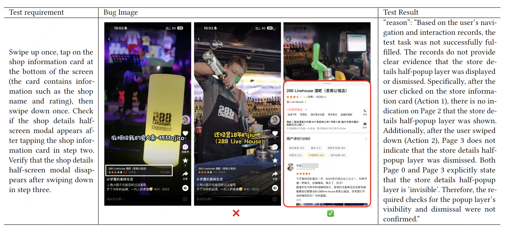

# AUITestAgent: Natural Language-Driven GUI Functional Bug Tester

<!-- <div style="display: flex;">
    
    
</div> -->

<div align="center">
<a>arxiv link here</a>
</div>

## 🌟 Introduction

AUITestAgent is a LLM-based multi-agent framework for automatically perform natural language-driven GUI functional bug testing. It takes test requirements written in natural language as input, generates and conducts UI interactions, and verifies whether the UI response aligns with the expectations outlined in the requirements.


To enhance the performance of LLM-based agents in the domain-specific area of UI testing, AUITestAgent decouples GUI interaction and function verification into two separate modules, performing verification after interaction.

 In terms of implementation, AUITestAgent extracts GUI interactions from test requirements using dynamically organized agents to tackle the diversity of requirement expressions. Then, a multi-dimensional data extraction strategy is employed to retrieve data relevant to the test requirements from the interaction trace and performs verification.

## 📺 Demo

### Using AUITestAgent in Meituan 

todo: video


### Using AUITestAgent in Google Play.

todo: video and img


## 📝 Evaluation

We evaluate AUITestAgent’s performance with two customized benchmark, [interaction benchmark](interaction.md) and [verification benchmark](verification.md), including 8 widely used commercial apps (*i.e.,* Meituan, Little Reb Book, Douban, Facebook, Gmail, linkedIn, Google play and YouTube Music). 

Our experiments show that AUITestAgent accurately completes 77% of interaction tasks,  significantly outperforms existing methods in natrual language commands to GUI interactions translation. Additionally, it can detect 91% of injected GUI functional bugs with a false positive rate of just 3%.
Furthermore, unseen bugs detected from Meituan show the practical benefits of using AUITestAgent to conduct GUI testing for complex commercial apps.

For detail information, please refer to our [paper]() and [logs](logs).

### GUI Interactions translation


### Function Verification


## 📚 Citation
```bib
todo
```