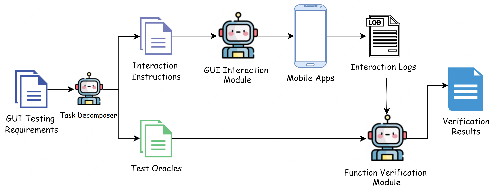
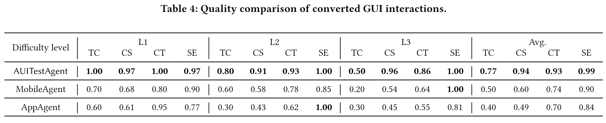
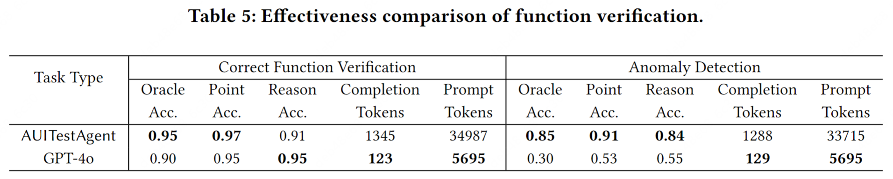

<div align="center">
<h1>AUITestAgent: 自然言語駆動のGUI機能バグテスター</h1>
</div>

<div align="center">
<a href='https://arxiv.org/abs/2407.09018'></a>
</div>

<div align="center">
  <a href="https://github.com/Gootter12">Yongxiang Hu<sup>1</sup></a>, 
  <a href="https://github.com/TSKGHS17">Xuan Wang<sup>1</sup></a>, 
  <a href="https://github.com/xieeryihe">Yingchuan Wang<sup>1</sup></a>, 
  <a href="https://github.com/RainPot">Yu Zhang<sup>2</sup></a>, 
  <a href="https://github.com/whiteguo233">Shiyu Guo<sup>2</sup></a>, 
  <a href="https://github.com/chenchaoyi">Chaoyi Chen<sup>2</sup></a>, 
  <a href="https://cs.fudan.edu.cn/3f/7e/c25906a278398/page.htm">Xin Wang<sup>1,3</sup></a> and 
  <a href="https://cs.fudan.edu.cn/3f/a9/c25909a278441/page.htm">Yangfan Zhou<sup>1,3</sup></a>

<br>

<sup>1</sup>School of Computer Science, Fudan University  
<sup>2</sup>Meituan, China  
<sup>3</sup>Shanghai Key Laboratory of Intelligent Information Processing, Shanghai, China
</div>

<div align="center">
<a href="README.md">English</a> | <a href="README_zh.md">简体中文</a> | <a href="README_ja.md">日本語</a>
</div>

## 🌟 プロジェクト紹介

AUITestAgentは、自然言語で記述されたテスト要件を入力として受け取り、UIインタラクションを生成および実行し、UI応答が要件に記載された期待に一致するかどうかを検証する、モバイルアプリのための最初の自動化された自然言語駆動のGUIテストツールです。



AUITestAgentは、UIテストの特定の領域におけるLLMベースのエージェントのパフォーマンスを向上させるために、GUIインタラクションと機能検証を2つの別々のモジュールに分離し、インタラクション後に検証を行います。

実装において、AUITestAgentはテスト要件からGUIインタラクションを抽出し、要件表現の多様性に対処するために動的に組織されたエージェントを使用します。次に、マルチディメンショナルデータ抽出戦略を使用して、インタラクショントレースからテスト要件に関連するデータを取得し、検証を行います。

## 📺 デモ

### MeituanでのAUITestAgentの使用
#### タスク：自然風光の最初の景点の評価を確認し、その評価が一貫しているかどうかを確認する

https://github.com/user-attachments/assets/48341d06-bc05-4b71-accd-c8a1c7215834


### FacebookでのAUITestAgentの使用
#### タスク：「Hello everyone」という内容の投稿を送信し、いいねを押し、正しく表示されているか、いいねボタンが青くなっているかを確認する

https://github.com/user-attachments/assets/8c0a33ab-11ab-4f95-b767-678472e8d902


## 📝 評価

私たちは、8つの広く使用されている商用アプリ（Meituan、Little Red Book、Douban、Facebook、Gmail、LinkedIn、Google Play、YouTube Music）を含む2つのカスタマイズされたベンチマーク、[インタラクションベンチマーク](interaction.md)と[検証ベンチマーク](verification.md)を使用して、AUITestAgentのパフォーマンスを評価しました。包括的な評価を提供するために、インタラクションタスクの難易度を3つのレベルに分類しました：簡単（L1）、中程度（L2）、難しい（L3）。各レベルについて、10のインタラクションタスクを構築し、説明を英語と中国語で均等に分けました。

私たちの実験では、AUITestAgentはレベル1のタスクを100％正確に完了し、レベル2のタスクの80％、レベル3のタスクの50％を完了しました。さらに、AUITestAgentが生成したインタラクションの94％が手動インタラクションを通じて得られたグラウンドトゥルースと一致しています。これらの指標は、**AUITestAgentが自然言語コマンドをGUIインタラクションに変換する際に既存の方法を大幅に上回っていることを示しています**。さらに、AUITestAgentは注入されたGUI機能バグのリコール率が90％に達し、誤検知率はわずか4.5％にとどまります。さらに、Meituanで未検出のバグを検出することに成功したことは、複雑な商用アプリのGUIテストにAUITestAgentを使用する実際の利点を強調しています。

詳細については、私たちの論文と[評価結果](evaluation_results/evaluation.md)を参照してください。

### GUIインタラクション

詳細な結果については、[インタラクションベンチマーク](interaction.md)を参照してください。



ベースライン：
* [MobileAgent](https://github.com/X-PLUG/MobileAgent)
* [AppAgent](https://github.com/mnotgod96/AppAgent)

### 機能検証

詳細な結果については、[検証ベンチマーク](verification.md)を参照してください。



AUITestAgentは、自然言語駆動のGUI機能検証に焦点を当てた**最初の**ツールであり、この分野には既存の研究がないため、**GPT-4oをベースラインとして**使用してマルチターンダイアログに基づく検証方法を構築しました。

## 📚 引用
この研究があなたの研究に役立つと感じた場合は、私たちの論文を引用することを検討してください。

```bib
@misc{hu2024auitestagent,
      title={AUITestAgent: Automatic Requirements Oriented GUI Function Testing}, 
      author={Yongxiang Hu and Xuan Wang and Yingchuan Wang and Yu Zhang and Shiyu Guo and Chaoyi Chen and Xin Wang and Yangfan Zhou},
      year={2024},
      eprint={2407.09018},
      archivePrefix={arXiv},
      primaryClass={cs.SE}
}
```

## 🧑 チーム紹介

AUITestAgentは、復旦大学の[周揚帆教授のチーム](https://appsrv.cse.cuhk.edu.hk/~yfzhou/)と美団のインストアR&Dプラットフォームの共同作業です。私たちは、フルスタックフロントエンド技術のAI分野に長い間専念してきました。AUITestAgentに加えて、[vision-ui](https://github.com/Meituan-Dianping/vision-ui)、[Appaction](https://dl.acm.org/doi/10.1145/3611643.3613885)、[AutoConsis](https://dl.acm.org/doi/abs/10.1145/3639477.3639748)など、いくつかの他の技術革新を開発しました。
