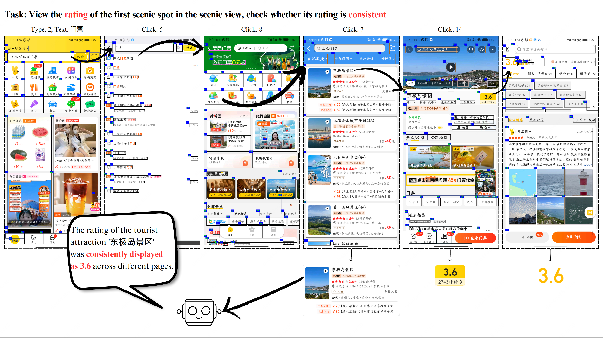

<div align="center">
<h1>AUITestAgent: 自然语言驱动的GUI异常检测工具</h1>
</div>

<div align="center">
<a href='https://arxiv.org/abs/2407.09018'></a>
</div>

<div align="center">
  <a href="https://github.com/Gootter12">胡永祥<sup>1</sup></a>，
  <a href="https://github.com/TSKGHS17">王轩<sup>1</sup></a>，
  <a href="https://github.com/xieeryihe">王颖川<sup>1</sup></a>，
  <a href="https://github.com/RainPot">张雨<sup>2</sup></a>，
  <a href="https://github.com/whiteguo233">郭诗雨<sup>2</sup></a>，
  <a href="https://github.com/chenchaoyi">陈超轶<sup>2</sup></a>，
  <a href="https://cs.fudan.edu.cn/3f/7e/c25906a278398/page.htm">王新<sup>1,3</sup></a>，
  <a href="https://cs.fudan.edu.cn/3f/a9/c25909a278441/page.htm">周扬帆<sup>1,3</sup></a>

<br>

<sup>1</sup>复旦大学  
<sup>2</sup>美团  
<sup>3</sup>上海市智能信息处理重点实验室
</div>

<div align="center">
<a href="README.md">English</a> | <a href="README_zh.md">简体中文</a>
</div>

<!-- <div style="display: flex; justify-content: center; align-items: center;">
  
  
</div> -->

## 🌟 项目简介

AUITestAgent 是首个能够基于自然语言测试用例，自动化完成终端UI测试驱动、校验全流程的智能化测试工具。仅需输入自然语言形式的测试需求，AUITestAgent通过多个智能代理（Agent）的合作，能够自动化进行从交互到检查的全链路测试过程，包括：自动与移动应用进行交互，然后自动执行对交互过程的检查，最后输出对应的测试结果。


在实现方面，AUITestAgent 从测试需求中提取 GUI 交互，利用动态组织的智能代理应对需求表达的多样性。随后，采用多维数据提取策略，从交互轨迹中提取与测试需求相关的数据并进行验证。

## 📺 示例

### 在美团中使用AUITestAgent 
#### 任务：查看景点门票频道中自然风光下第一个景点的评分，检查其评分在不同页面上是否一致

https://github.com/user-attachments/assets/48341d06-bc05-4b71-accd-c8a1c7215834



### 在脸书中使用AUITestAgent
#### 任务：发送一条内容为"Hello everyone"的推文并点赞，检查推文发送后是否在主页显示，检查点赞后点赞按钮是否变为蓝色

https://github.com/user-attachments/assets/8c0a33ab-11ab-4f95-b767-678472e8d902


## 📝 实验

我们使用两个自定义基准，[交互基准](interaction_zh.md)和[校验基准](verification_zh.md)，评估了AUITestAgent的性能。基准中包括8个广泛使用的商业应用（即美团、小红书、豆瓣、Facebook、Gmail、LinkedIn、Google Play和YouTube Music）。为了提供全面的评估，我们将交互任务的难度分为三个级别：简单（L1）、中等（L2）和困难（L3）。对于每个级别，我们构建了十个交互任务，中英文各半。

我们的实验表明，AUITestAgent准确完成了100%的L1任务，在L2任务中完成了80%，在L3任务中完成了50%。此外，通过人工交互验证，AUITestAgent生成的交互中有94%与实际情况一致。这些指标表明，**AUITestAgent在将自然语言命令转换为GUI交互方面显著优于现有方法**。此外，AUITestAgent对注入的GUI功能错误的召回率达到90%，同时保持了仅4.5%的低误报率。AUITestAgent在美团中检测到新异常进一步展示了其在复杂商业应用GUI测试中的实际优势。

有关详细信息，请参阅我们的论文和[评估结果](evaluation_results/evaluation_zh.md)。

### UI交互实验

有关详细信息，请参阅我们的[交互基准](interaction_zh.md)。


基线方法：
* [MobileAgent](https://github.com/X-PLUG/MobileAgent)
* [AppAgent](https://github.com/mnotgod96/AppAgent)


### 功能校验实验

有关详细信息，请参阅我们的[校验基准](verification_zh.md)。


由于AUITestAgent是**首个**专注于自然语言驱动的GUI功能验证的工具，并且该领域尚无现有研究，我们基于多轮对话构建了一种验证方法，并使用**GPT-4o作为基线方法**。（仅在该实验中使用了这一大模型，在实际业务使用的场景下，我们使用了另一个模型）

## 📚 引用
如果您发现这项工作对您的研究有帮助，请考虑引用我们的论文。

```bib
@misc{hu2024auitestagent,
      title={AUITestAgent: Automatic Requirements Oriented GUI Function Testing}, 
      author={Yongxiang Hu and Xuan Wang and Yingchuan Wang and Yu Zhang and Shiyu Guo and Chaoyi Chen and Xin Wang and Yangfan Zhou},
      year={2024},
      eprint={2407.09018},
      archivePrefix={arXiv},
      primaryClass={cs.SE}
}
```

## 🧑 团队介绍

AUITestAgent 是复旦大学[周扬帆老师团队](https://appsrv.cse.cuhk.edu.hk/~yfzhou/)和美团到店研发平台合作完成的工作。我们长期在大前端智能化领域深耕，除AUITestAgent之外还有多项技术沉淀，包括[vision-ui](https://github.com/Meituan-Dianping/vision-ui), [Appaction](https://dl.acm.org/doi/10.1145/3611643.3613885)和[AutoConsis](https://dl.acm.org/doi/abs/10.1145/3639477.3639748).
