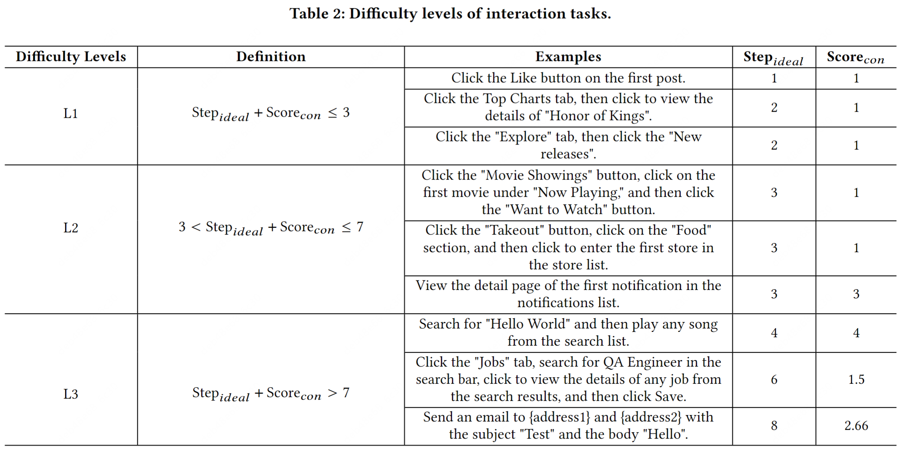

# Interaction Evaluation Benchmark

## Difficulty Level

We assessed the difficulty level from two perspectives: the ideal number of interaction steps $𝑆𝑡𝑒𝑝_{𝑖𝑑𝑒𝑎𝑙}$ and the vagueness of the requirements (i.e., metric $𝑆𝑐𝑜𝑟𝑒_{vag}$ is defined as the ideal number of interaction steps $𝑆𝑡𝑒𝑝_{𝑖𝑑𝑒𝑎𝑙}$ divided by the number of interaction commands in the requirements)

## Tasks
Here are 30 tasks we used to measure the interaction capability of AUITestAgent on 8 different Android apps.

| **App**           |      | **Task**                                                 | **$Step_{ideal}$** | **$Score_{vag}$**  | **$Score$** | **Difficulty** |
| ----------------- | ---- | ------------------------------------------------------------ | -------- | ------------- | --------- | -------- |
| **美团**          | 1    | 点击“外卖”按钮                                               | 1        | 1 / 1 = 1     | 2         | L1       |
|                   | 2    | 点击“我的”，点击进入设置页面                                 | 2        | 2 / 2 = 1     | 3         | L1       |
|                   | 3    | 点击左上角的定位信息，修改定位改为北京市                     | 2        | 2 / 2 = 1     | 3         | L1       |
|                   | 4    | 点击“外卖 ”按钮，点击“美食”分区，点击进入店铺列表第一家店铺  | 3        | 3 / 3 = 1     | 4         | L2       |
|                   | 5    | 点击“电影演出”按钮，点击“正在热映”下的第一部电影，点击“想看”按钮 | 3        | 3 / 3 = 1     | 4         | L2       |
|                   | 6    | 搜索“门票”，点击搜索推荐中的“景点门票频道”，点击“景点”按钮，点击景点列表的第一个景点，点击查看景点的评分 | 6        | 6 / 5 = 1.25  | 7.25      | L2       |
|                   | 7    | 开启App的“长辈模式”                                          | 4        | 4 / 1 = 4     | 8         | L3       |
|                   | 8    | 删除我的全部收藏                                             | 5        | 5 / 1 = 5     | 10        | L3       |
|                   | 9    | 点击“我的”，点击设置，新增一个收货地址，点击选择收货地址，选择屏幕下方列表中的第一个地址，然后填写门牌号01，姓名小明，手机号13800000000，最后保存地址 | 10       | 10 / 9 = 1.11 | 11.11     | L3       |
| **小红书**        | 10   | 点击第一条推文，点击点赞按钮                                 | 2        | 2 / 2 = 1     | 3         | L1       |
|                   | 11   | 点击“我”，点击设置按钮，点击“隐私设置”，点击“在线状态”，将其修改为“公开” | 5        | 5 / 5 = 1     | 6         | L2       |
|                   | 12   | 点击导航栏的“购物”按钮，点击一个商品卡片的商品，按照默认配置加入购物车，然后去购物车页面，删除购物车中的所有商品 | 8        | 8 / 5 = 1.6   | 10.6      | L3       |
| **豆瓣**          | 13   | 点击第一条推文的点赞按钮                                     | 1        | 1 / 1 = 1     | 2         | L1       |
|                   | 14   | 点击“书影音”标签，点击豆瓣榜单，点击近期热门电影Top20榜单，点击榜单第一部电影的“想看” | 4        | 4 / 4 = 1     | 5         | L2       |
|                   | 15   | 点击“我”标签，点击“创建我的书影音”，在屏幕中央向左划，点击创建我的图书TOP10，依次勾选列表中的前三本书，点击确定，点击发布 | 9        | 9 / 7 = 1.29  | 10.29     | L3       |
| **Facebook**      | 16   | Click the Like button on the first post                      | 1        | 1 / 1 = 1     | 2         | L1       |
|                   | 17   | Click the "What's on your mind?" input box, then send a post with the content "Hello everyone" | 4        | 4 / 2 = 2     | 6         | L2       |
|                   | 18   | Click the top Profile tab, click Edit Profile, scroll until you find the Bio section, click the Add button in the Bio section, click "Describe yourself", edit the content to "Hello Sky" and save | 7        | 7 / 7 = 1     | 8         | L3       |
| **Gmail**         | 19   | Click to view the first email, then mark it as a favorite    | 2        | 2 / 2 = 1     | 3         | L1       |
|                   | 20   | Send an empty email to {address}                             | 4        | 4 / 2 = 2     | 6         | L2       |
|                   | 21   | Send an email to {address1} and {address2} with the subject "Test" and the body "Hello" | 8        | 8 / 3 = 2.66  | 10.66     | L3       |
| **LinkedIn**      | 22   | Click the avatar of the user who posted the first tweet      | 1        | 1 / 1 = 1     | 2         | L1       |
|                   | 23   | View the detail page of the first notification in the notifications list | 3        | 3 / 1 = 3     | 6         | L2       |
|                   | 24   | Click the "Jobs" tab, search for QA Engineer in the search bar, click to view the details of any job from the search results, and then click Save | 6        | 6 / 4 = 1.5   | 7.5       | L3       |
| **Google Play**   | 25   | Click the Top Charts tab, then click to view the detail of "Honor of Kings" | 2        | 2 / 2 = 1     | 3         | L1       |
|                   | 26   | Click the Books tab, then enter the ratings and reviews section of the first book | 3        | 3 / 2 = 1.5   | 4.5       | L2       |
|                   | 27   | Download WhatsApp                                            | 4        | 4 / 1 = 4     | 8         | L3       |
| **YouTube Music** | 28   | Click the "Explore" tap, then click the "New releases"       | 2        | 2 / 2 = 1     | 3         | L1       |
|                   | 29   | Search singer Jay Chou                                       | 3        | 3 / 1 = 3     | 6         | L2       |
|                   | 30   | Search for "Hello World" and then play any song from the search list | 4        | 4 / 1 = 4     | 8         | L3       |
