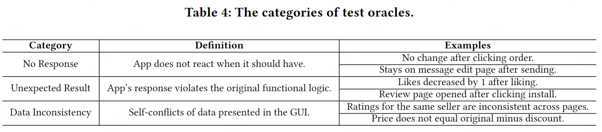

# 校验基准

## 测试预言分类

## 校验任务合集

校验任务包括 20 个测试预言，每个预言关联两个交互轨迹，一个是正确的，另一个包含了手动注入的异常。

*（在验证评估过程中，我们直接输入了测试预言。然而，在实际操作中，AUITestAgent 的输入是包含交互任务和测试预言的原始测试需求，这两者由 任务分解者 分开。）*

| **App**           |      | **交互任务**                                                 | **测试预言**                                                 | **异常**                           | **校验点个数** |
| ----------------- | ---- | ------------------------------------------------------------ | ------------------------------------------------------------ | ------------------------------------------ | -------------- |
| **美团**          | 1    | 点击“外卖”按钮                                               | 检查点击“外卖”按钮后是否进入外卖页面                         | （无响应）点击按钮后无响应                 | 1              |
|                   | 2    | 点击左上角的定位信息，修改定位改为北京市                     | 检查修改定位后主页定位是否为北京                             | （不合预期）修改后主页定位没有变化         | 1              |
|                   | 3    | 点击“外卖 ”按钮，点击“美食”分区，点击进入店铺列表第一家店铺  | 检查美食分区列表页下第一家店铺的名称和评分是否和店铺详情页的这些数据一致 | （不一致）评分不一致                       | 2              |
|                   | 4    | 在电影演出中，选择“正在热映”下的第一部电影，点击“想看”按钮   | 检查点击想看按钮后，按钮是否变灰且文本变为“已想看”           | （无响应）按钮点击后无响应                 | 2              |
|                   | 5    | 搜索“门票”，点击搜索推荐中的“景点门票频道”，点击“景点”按钮，点击景点列表的第一个景点，点击查看景点的评分 | 检查迪士尼在不同页面间的评分是否一致                         | （不一致）景点详情页评分不一致             | 1              |
|                   | 6    | 点击“我的”，点击设置，新增一个收货地址，点击选择收货地址，选择屏幕下方列表中的第一个地址，然后填写门牌号01，姓名小明，手机号13800000000，最后保存地址 | 检查保存地址后收货地址的地点和姓名是否等于输入的值           | （不一致）收货地址中姓名不一致             | 2              |
| **小红书**        | 7    | 点击第一条推文，点击点赞按钮                                 | 检查点击点赞按钮后按钮是否变红，点赞数是否加1                | （不合预期）点赞数减少1                    | 2              |
|                   | 8    | 点击“我”，点击设置按钮，点击“隐私设置”，点击“在线状态”，将其修改为“公开” | 检查修改为“公开”后的在线状态是否变为公开                     | （无响应）勾选后在线状态未发生变化         | 1              |
| **豆瓣**          | 9    | 点击“书影音”标签，点击豆瓣榜单，点击近期热门电影Top20榜单，点击榜单第一部电影的“想看” | 检查点击想看按钮后其是否变为“已想看”                         | （无响应）点击想看按钮后未响应             | 1              |
|                   | 10   | 点击第一条推文的评论按钮                                     | 检查第一条推文的评论数在点击前后是否一致                     | （不一致）点击前后评论数不一致             | 1              |
| **Facebook**      | 11   | Click the "What's on your mind?" input box, then send a post with the content "Hello everyone" | Check whether the post's content("Hello everyone") is correctly displayed on the homepage after sending it | （Unexpected Result）The content of the Post has changed           | 1              |
|                   | 12   | Click the top Profile tab, click Edit Profile, scroll until you find the Bio section, click the Add button in the Bio section, click "Describe yourself", edit the content to "Hello Sky" and save | Check that the Bio's content is correctly displayed after clicking the Save button | （Unexpected Result）The content of the Bio has changed            | 1              |
| **Gmail**         | 13   | Click to view the first email, then mark it as a favorite    | Check whether the favorite button turns blue after clicking it | （No Response）No response after clicking the favorite button                | 1              |
|                   | 14   | Send an email to {address1} and {address2} with the subject "Test" and the body "Hello" | Check on the email editing page whether the recipient, email subject, and email body are correctly displayed after typing, and check whether the email is sent after clicking send | （Unexpected Result）After typing the email content, the email title abnormally becomes empty | 4              |
| **LinkedIn**      | 15   | Click the avatar of the user who posted the first tweet      | Check whether entered the user's homepage after clicking, whether the user's introduction and name are consistent before and after clicking | （Unexpected Result）The introduction changes after clicking             | 3              |
|                   | 16   | View the detail page of the first notification in the notifications list | Check that the title of the first notification in the notification list is consistent after clicking it | （Unexpected Result）The title changes after clicking             | 1              |
| **Google Play**   | 17   | Click the Top Charts tab, then click to view the detail of "Honor of Kings" | Check whether the name and rating of Honor of Kings are consistent on the list page and the details page; Check whether the game tags are in [new, Action, Strategy, MOBA, Casual, multi-player] | （Data Inconsistency）Inconsistent game tags                  | 3              |
|                   | 18   | Download WhatsApp                                            | Check whether the download starts after clicking install     | （No Response）No response after clicking install                 | 1              |
| **YouTube Music** | 19   | Click the "Explore" tap, then click the "New releases"       | Check whether you enter the corresponding pages respectively after clicking explore and new releases | （Unexpected Result）Enter the style page after clicking new releases | 2              |
|                   | 20   | Search for "Hello World" and then play any song from the search list | Check that after clicking the play button, whether the play button showing the song is playing | （Unexpected Result）Enter the comment area after clicking the play button       | 1              |
